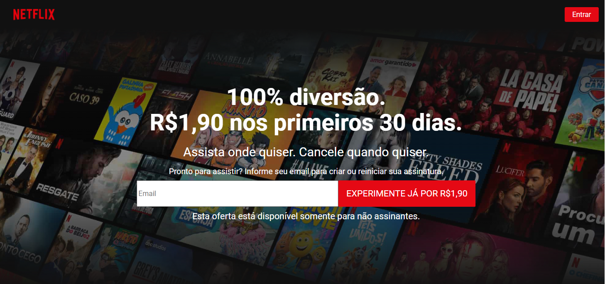
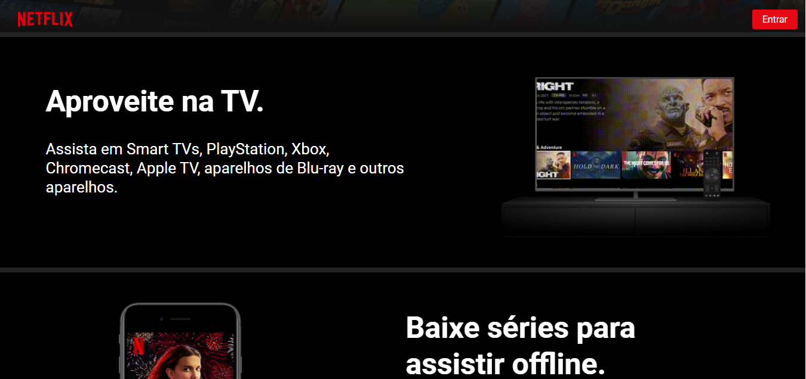
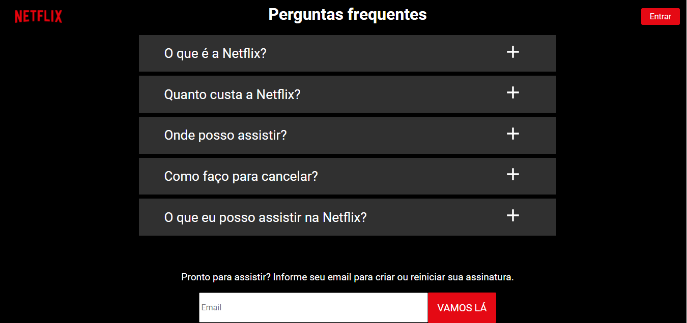

# Netflix Clone

<h1 align="center">
    
</h1>

## Sobre
O projeto Netflix clone é educacional, foi desenvolvido na live do youtube 
Bonieky Lacerda.

### Obs
aproveitando a oportunidade, desenvolvi a tela home como mostrar as fotos abaixo.

<h1 align="center">
    
</h1>
<h1 align="center">
    
</h1>
<h1 align="center">
    
</h1>

## Tecnologia

#### Reactjs


---
## Como baixar o projeto

```bash
#Clona repositório
$ git clone 
#Entra no diretório
$ cd netflixclone1
#Entra na pasta 
$ npm install 
#Obetenha sua Api_key do TMDB    
$API_KEY TMDB
#Inicia o projeto
$ npm start
```

---

Desenvolvido por Eduardo Pedro, Edp2013.ep@gmail.com